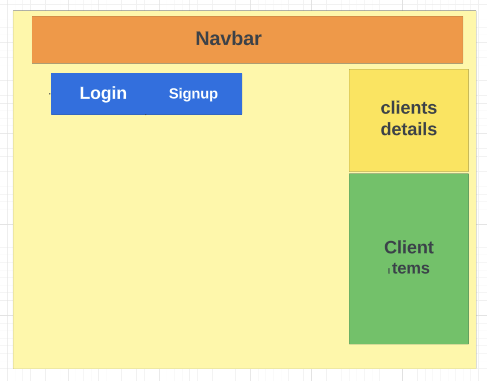

#  PROJECT NAME :
## Project 2 (Sabby's Online Store!)

## Below is the Link to Trello Board :

[TRELLO BOARD](https://trello.com/invite/b/n5d3X9JM/ATTIe233bf746afa99a3cded91eb08545cc4677A3742/project-2)

# Project Main Image :

## Wire Frame :

# Title : " Despatch Log ! "

# Table Of Content:

### .Built with

### .Dependencies Required

### .Prerequisites

### .Usage

### .contact Info

## BUILT WITH( technologies used ):

### 🔘 Node.js

### 🔘 express

### 🔘 mongoose Atlas DB

### 🔘 CSS

### 🔘 Javascript

## Dependencies Required:(download dependencies in the terminal using following commands e.g : npm install 'dependency name')

### 🔘 bcrypt : npm install bcrypt

### 🔘 dotenv : npm install dotenv

### 🔘 ejs : npm install ejs

### 🔘 express: npm install express

### 🔘 express-ejs-layouts: npm install express-ejs-layouts

### 🔘 express-session : npm install express-session

### 🔘 method-override : npm install method-override

### 🔘 mongoose : npm install mongoose

### 🔘 morgan : npm install morgan

## PREREQUISITES (installations needed before you start) :

## Node.js : https://nodejs.dev/en/download/ and follow there documentation

## express : https://expressjs.com/en/starter/installing.html and follow there documentation

## USAGE:

### In this Application you will be able to manage and check the daily Despatch schedule for the consignments to the clients. you would also be able to create/edit/update and delete a client by logging in as a registered user.

### CONTACT INFO:

### my linkedin profile : https://www.linkedin.com/in/nagpal-dinesh/

### facebook : https://www.facebook/username.com

### youtube channel: https://www.youtube/myusername.com 
